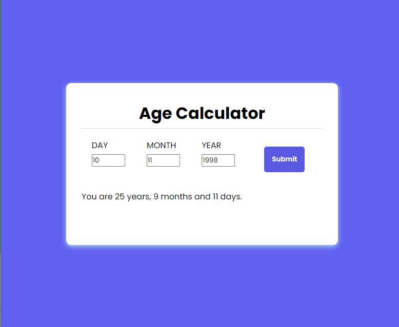

# Age Calculator

## Overview

This project is part of the Codevixens 10 Days of Frontend Challenge (Day 1). This age calculator web application was built using Vite React and styled with TailwindCSS. The task focuses on mastering  state management, event handling and creating a simple user interface in ReactJS.

## Features

- **State Management:** React's **useState**  hook were used to manage input value and calculated age.
- **Event Handling:** Handles user inputs and button events to calculate age.
- **User Interface:** Simple UI that allows user's input day, month and year they desire to calculate.

## Installation

1. Clone the repository: ```javascript git clone https://github.com/Nkwor-Jane/ageCalculator.git```

2. Navigate to the project directory: ```javascript cd ageCalculator```

3. Install dependencies:```javascript npm install```

## Usage

1. Start the development server: ```javascript npm run dev```

2. Open your browser and navigate to: ```javascript http://localhost:5173/```

## How it Works

1. **Input Fields:** Enter the birthdate you wish to calculate (day, month and years).
2. **Submit Button:** Click submit button to calculate age differnce from date inputted to current date.
3. **Display:** The age will be displayed.

## Screenshots

- Before input
  


- After input


## Live Demo

Check out the live demo [here](https://magnificent-kulfi-d0e315.netlify.app/).

## Contirbuting

Feel free to clone and fork this repository. You can also submit pull requests. Any conributions are welcome!

## License

This project is licensed under the MIT License

## Acknowledgements

- [Codevixens](https://codevixens.org/) for organizing this challenge.
- Lois Bassey, Chinaza Igboanugo, Gaelle Tiku Brenda - and Oyakinsola Shoroye for their contributions and guidance towards the successful completion of this projects.

Feel free to customize it further to fit your needs! If you have any specific details you'd like to add or change, let me know.
